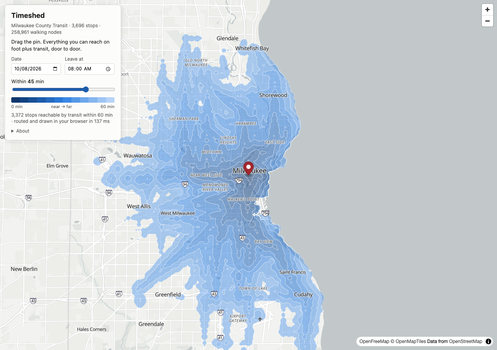
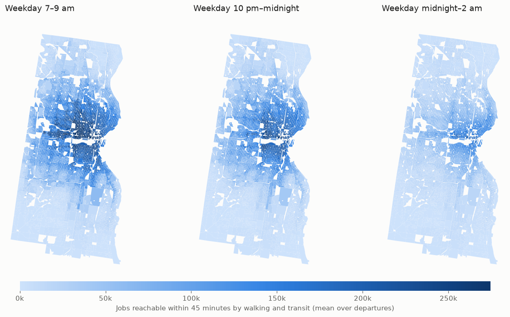
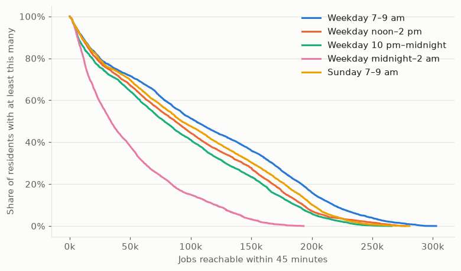
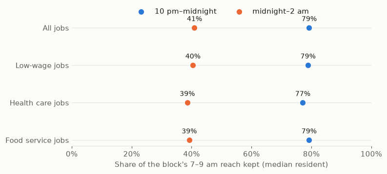
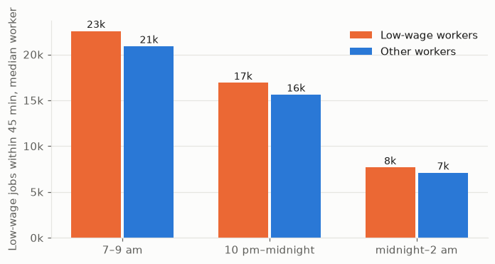
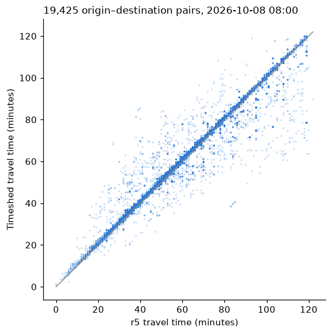

# Timeshed

[](https://github.com/FrankBStack/Timeshed/actions/workflows/ci.yml)

A door-to-door transit travel time engine, and what it says about Milwaukee after dark.

Drop a pin anywhere in Milwaukee County and the area you can reach within N minutes by
walking plus public transit redraws in about a tenth of a second. The routing is an
own implementation of [RAPTOR](https://www.microsoft.com/en-us/research/wp-content/uploads/2012/01/raptor_alenex.pdf)
over the agency's published GTFS schedule, joined to a walking graph built from
OpenStreetMap, so a query covers walking to the stop, riding, transferring and walking
to the door. Because the schedule is real, 8 am and 11 pm give different shapes.



**Try it:** the live map runs entirely in your browser at
<https://timeshed.frankbs.dev/live/>. The same Rust engine is compiled
to WebAssembly and runs in a web worker; the page downloads a 7 MB bundle (the
whole county's schedule and walking network) once, then answers each drag in
about 140 ms with no server involved.

Everything is built from two free sources: the [MCTS GTFS feed](https://kamino.mcts.org/gtfs/google_transit.zip)
and the [Geofabrik Wisconsin extract](https://download.geofabrik.de/north-america/us/wisconsin.html).

## The finding: Milwaukee's transit holds up until midnight, then falls off a cliff

The usual accessibility number, jobs reachable by transit in the morning peak, already
exists for every large US metro (the University of Minnesota's Access Across America
series). So this asks a question that series does not: **how much of that access
survives late at night?** For every inhabited 2020 census block in Milwaukee County
(10,685 blocks, 938,501 residents) the engine computed the number of jobs reachable
within 45 minutes door to door, leaving every 10 minutes across a two-hour window and
averaging. Jobs are 2023 LODES workplace counts by block (547,164 jobs inside the
walking network's bounding box, 496,457 of them in the county).

| Leaving | Median resident can reach | Mean | Residents reaching 100k+ | Residents under 5k |
|---|---:|---:|---:|---:|
| Weekday 7–9 am | **104,226** jobs | 112,169 | 51% | 5.0% |
| Weekday noon–2 pm | 87,064 | 96,218 | 44% | 5.1% |
| Weekday 10 pm–midnight | **78,129** | 88,938 | 41% | 6.5% |
| Weekday midnight–2 am | **33,932** | 48,648 | 15% | 7.0% |
| Sunday 7–9 am | 92,406 | 101,587 | 48% | 5.2% |

All figures are population weighted.

- Between 10 pm and midnight the median block still has **79%** of its morning job
  access. Only 4% of residents lose more than half. Sunday morning is nearly a weekday.
- After midnight the number drops to **41%** of the morning value. Two thirds of
  residents lose more than half their access, and one in ten loses three quarters.
- That matches the schedule: a dozen or so routes still have departures after
  midnight, and after 1 am it is mostly the Green Line (Bayshore to the airport through
  downtown), the Purple Line (27th Street), the Blue Line and route 30. The map of what
  survives is downtown, the east side and the Green Line corridor; the south and
  northwest edges of the county fall back to walking distance. (In the ratio view of
  the published map, blocks at the far edges show ratios near 1 only because they had
  little transit access in the morning to begin with.)





The interactive version, with every block hoverable and each window selectable, is in
[`docs/`](docs/) and published at <https://timeshed.frankbs.dev/>.
The per-block table is written to `data/analysis/access_by_block.csv` by the analysis
script.

### Who loses after midnight

The obvious follow-up is whether the people who work nights are the ones left
without a bus. LODES breaks jobs out by wage band and sector, and workers by wage
band at their home block, so the same batch runs answer it. Two things I expected
to find, and did not:

- **Low-wage workers are not disproportionately stranded.** Weighted by where
  low-wage workers (under $1,250 a month) live, the median one can reach 22,556
  low-wage jobs at 8 am and 7,654 after midnight, keeping 40% of morning access.
  Weighted by everyone else, the numbers are 20,886, 7,078 and 40%. Low-wage
  workers live closer to the frequent network, so they start slightly ahead and
  fall by the same share. Only the quarter of blocks with the highest low-wage
  share does a little worse (38% kept against 41 to 43%).
- **The night-shift sectors fall like everything else.** Health care (101,590
  jobs in the study area) and food service (41,444) keep 39% of the morning reach
  after midnight; all jobs keep 41%. The after-midnight network is a few radial
  lines through the core, and it does not favour hospitals.





What that uniformity hides is how little is left in absolute terms: after
midnight, a third of low-wage workers can reach fewer than 5,000 low-wage jobs
within 45 minutes, and two thirds of residents can reach fewer than 5,000 food
service jobs. The equity problem in Milwaukee's late-night transit is not that it
cuts some neighbourhoods more than others. It is that after 1 am it cuts
everyone to the Green, Purple and Blue lines and route 30, and that whether you
can get to a night shift depends on whether you happen to live on one of them.

(`analysis/night_shift.py`; "low-wage" is LODES earnings band CE01, which also
includes part-time and student workers.)

### Caveats

- Schedules, not real time. A 45-minute budget on paper is a 45-minute budget on a day
  when every bus is on time. The feed is MCTS's September 2026 schedule.
- Walking is 1.3 m/s on the OSM pedestrian network, with footpaths between stops up to
  1 km. Stops and blocks are snapped to the nearest walkable node.
- Only trips on the queried service day count. After-midnight departures use the
  previous day's late trips (GTFS times past 24:00), which is what matters for the
  midnight–2 am window; no next-morning trips are needed before 4 am.
- No boarding slack: a bus that leaves the second you reach the stop counts as
  caught. r5 and OpenTripPlanner assume a minute of slack; `--board-slack` turns it on.
- Jobs are counted at the block they are in, reached if the block's internal point is
  reachable. Jobs outside the walking bounding box, and transit run by neighbouring
  counties' systems, are not included. The Hop streetcar is a separate feed and is not
  included.
- LODES 2023 jobs against a 2026 schedule.

## How it works

```
GTFS zip ──> gtfs.rs ──> timetable.rs ──┐
                                        ├──> engine.rs (snap stops, build footpaths) ──> bundle.bin
OSM .pbf ──> osm.rs  ──> walk.rs ───────┘                                                  │
                                                          ┌────────────────────────────────┘
         query:  walk (Dijkstra) ──> raptor.rs ──> walk (multi-source Dijkstra)
                                        │                 │
                 reference.rs: brute force, checks raptor.rs on random feeds and the real one
                                                          │
         isochrone.rs: node labels ──> 100 m grid ──> marching squares ──> GeoJSON bands
         access.rs:    node labels ──> destination blocks ──> weighted sums, in parallel
         wasm.rs:      the same query + isochrone.rs behind wasm-bindgen, for the browser
         server.rs:    the same behind axum, for `timeshed serve`
```

- **Timetable.** GTFS routes are regrouped into RAPTOR routes: trips that share an
  exact stop sequence and never overtake each other. The MCTS feed needs 322 of them
  for its 52 routes; 101 of those exist only because June and September variants of
  the same trip differ by a minute at some stop. Frequency-based trips are expanded.
  Service is resolved per date from `calendar.txt` and `calendar_dates.txt`.
- **Walking graph.** Two passes over the state extract: node coordinates inside the
  bounding box (the stops' box plus 2.5 km), then ways a pedestrian can use. Ways
  leaving the box are cut at its edge; only the largest connected component is kept;
  runs of shape nodes are merged into single edges of at most 150 m. Milwaukee County
  reads as 593k nodes and ends up at 259k nodes and 818k directed edges.
- **RAPTOR.** Standard round-based scan with per-round labels, local pruning against the
  best-known arrival and a time budget, binary search for the first catchable trip
  (valid because routes are non-overtaking), and footpaths relaxed to a fixed point
  after each round, since ours are a bounded walking search rather than a transitive
  closure.
- **Door to door.** A bounded Dijkstra from the origin seeds every stop in walking
  reach; RAPTOR runs; a multi-source Dijkstra from every reached stop labels the walking
  nodes. Isochrones splat node labels onto a 100 m grid and cut it into 5-minute bands.
- **Batch.** Destinations are snapped once; each origin's query is read at each
  destination's node. Rayon runs origins in parallel with one query workspace per
  thread.

### How I know the router is right

RAPTOR is easy to get subtly wrong, so there is a second router that is easy to
get right: a plain time-dependent Dijkstra over stops on the raw feed, with no
route grouping, no rounds and no pruning (`src/reference.rs`). Two checks run
against it:

- `cargo test` builds 200 random feeds with loops, short-turns, frequency-based
  trips, no-pickup and no-drop-off stops, two service patterns and random
  footpaths, and compares every stop label from RAPTOR with brute force over
  10,000 queries.
- `timeshed verify` does the same on a real bundle. On the Milwaukee feed, 5,000
  random queries (one to three origin stops, any date in the feed, any hour,
  90-minute budget) compared 17 million reached stop labels with zero
  disagreements, and the default cap of six transit legs lost none of them.

The property test earned its keep immediately: it caught the earliest-trip
assumption breaking when the first catchable trip refuses to let you off at a
stop where a later trip on the same stop sequence does. Routes are now grouped
by board/alight pattern as well as stop sequence.

Those checks prove RAPTOR agrees with a simpler router on the same data. To check
the whole door-to-door pipeline, including the walking graph, snapping and
transfers, `analysis/crosscheck_r5.py` runs the same 150 origins and 150
destinations through [r5](https://github.com/conveyal/r5) (Conveyal's router, via
r5py) on the same feed and OSM extract, leaving at 8:00 on the same weekday with a
two-hour budget. The two share no code.



| | |
|---|---:|
| Pairs reachable by both within two hours | 19,425 of 22,500 |
| Reachable by only one router (nearly all over 80 minutes, at the edge of the budget) | 780 Timeshed, 51 r5 |
| Median difference (Timeshed minus r5) | +0.5 min |
| Within 1 / 2 / 5 minutes | 68% / 86% / 92% |
| 10th to 90th percentile of the difference, trips under 90 minutes | −0.7 to +2.6 min |

The first run disagreed on a fifth of pairs, always with Timeshed faster. The
cause was R5's hard-coded 60-second boarding slack: it assumes you miss a bus
that leaves within a minute of your arrival at the stop. Adding the same rule
(`--board-slack 60`) produced the table above, and 60 seconds fits r5 better than
30, 90 or 120. The remaining tail is long trips and a handful of specific points
where the two routers attach a point to the street network differently. r5
reports whole minutes, which is where the +0.5 median comes from.

The analysis above uses no boarding slack, so its travel times are a hair
optimistic by r5's standard. It makes no visible difference to the findings.

### The browser build

The crate is split in two by a feature flag. The routing core (timetable,
walking graph, RAPTOR, isochrones, bundle deserialization) has no OS
dependencies and compiles for `wasm32`; the feed and PBF readers, the CLI, the
server and rayon sit behind the default `native` feature. `src/wasm.rs` exposes
the engine through wasm-bindgen with the same JSON shapes as the HTTP API, and
`web/app.js` picks a backend at load time: the server's `/api` when running
under `timeshed serve`, or a web worker running the wasm when the page names a
bundle URL. `scripts/build-web.sh` builds the package and assembles `docs/live`.

To make that practical the bundle had to shrink. Coordinates are f32, OSM ids are
gone, and runs of shape nodes are merged into edges of at most 150 m, which keeps
isochrones smooth while cutting Milwaukee's walking graph from 593k nodes to
259k. The bundle went from 39 MB to 21 MB, 7 MB gzipped, and queries got faster.
The browser inflates the gzip itself with `DecompressionStream`, so the host
needs no special configuration. GitHub release assets were the plan for hosting
the bundle, but they are served without CORS headers, so it ships next to the
page instead.

### Numbers on a 12-core laptop

| Step | Time |
|---|---:|
| Read the feed (1.0M stop_times) | 0.6 s |
| Full bundle build: walking graph from the 294 MB state extract, contraction, 106k footpaths | ~3 s |
| Door-to-door query, 45-minute budget | ~13 ms |
| 60-minute isochrone: 21 ms routing + 41 ms of bands, as GeoJSON | ~60 ms |
| Batch: 10,690 origins × 12 departures | ~110 s |
| Same 60-minute isochrone, WebAssembly in Brave, including drawing | ~140 ms |

## Running it

```sh
# build the bundle (any GTFS feed plus an OSM extract that covers it)
cargo run --release -- build --gtfs data/raw/gtfs/mcts.zip \
    --osm data/raw/osm/wisconsin-latest.osm.pbf \
    --name "Milwaukee County Transit" -o data/bundles/milwaukee.bin

# one query
cargo run --release -- query --bundle data/bundles/milwaukee.bin \
    --lat 43.0389 --lon -87.9100 --date 2026-10-08 --time 08:00 --max 45 --geojson iso.geojson

# the live map on http://127.0.0.1:8080
cargo run --release -- serve --bundle data/bundles/milwaukee.bin

# the same map as static files that route in the browser (needs wasm-pack)
scripts/build-web.sh data/bundles/milwaukee.bin && (cd docs && python3 -m http.server 8090)
# then open http://127.0.0.1:8090/live/
```

To reproduce the analysis:

```sh
python3 -m venv analysis/.venv && analysis/.venv/bin/pip install -r analysis/requirements.txt
analysis/.venv/bin/python analysis/prep_blocks.py \
    --blocks data/raw/census/tl_2020_55_tabblock20.zip \
    --wac data/raw/census/wi_wac_S000_JT00_2023.csv.gz \
    --rac data/raw/census/wi_rac_S000_JT00_2023.csv.gz \
    --county 079 --bbox=-88.1008,42.8483,-87.8187,43.2117 --out data/analysis

cargo run --release -- access --bundle data/bundles/milwaukee.bin \
    --origins data/analysis/origins.csv --dests data/analysis/dests.csv \
    --date 2026-10-08 --from 07:00 --to 09:00 --every 10 --max 45 \
    -o data/analysis/runs/weekday_am.csv
# ... the other windows: 12:00–14:00, 22:00–24:00, 24:00–26:00, and 2026-10-11 07:00–09:00

analysis/.venv/bin/python analysis/summarize.py
```

Census blocks come from [TIGER/Line 2020](https://www2.census.gov/geo/tiger/TIGER2020/TABBLOCK20/)
and jobs from [LODES 8](https://lehd.ces.census.gov/data/lodes/LODES8/wi/). The `data/`
directory is not committed.

## Layout

```
src/gtfs.rs        GTFS reader                 src/engine.rs     bundle + door-to-door query
src/timetable.rs   RAPTOR route grouping       src/isochrone.rs  grid + marching squares
src/osm.rs         walking graph from PBF      src/access.rs     batch accessibility
src/walk.rs        r-tree + bounded Dijkstra   src/server.rs     axum API
src/raptor.rs      the algorithm               src/reference.rs  brute-force router for checking
src/wasm.rs        browser bindings            web/              live map (MapLibre), worker
scripts/           build-web.sh assembles the browser build
analysis/          census + LODES prep, summary, figures, r5 cross-check
docs/              published results map, figures, and the browser build in docs/live
```

## License

MIT. Transit data is the agency's, map data is © OpenStreetMap contributors,
and census data is public domain.
